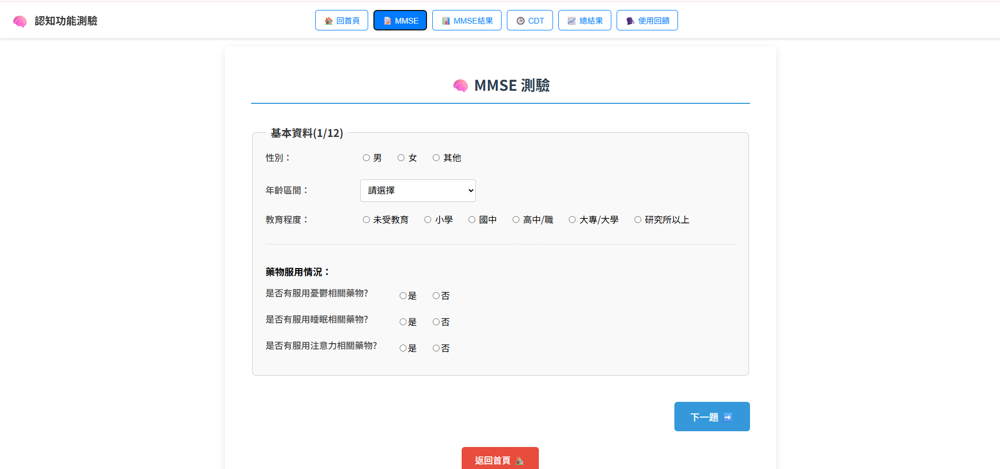

# 🧠 認知功能檢測系統

本系統整合了 MMSE 簡易智能量表與 CDT 畫鐘測驗，協助使用者於線上進行初步的認知功能篩檢與紀錄追蹤。

---

### 🏠 首頁畫面
用戶可輸入 Email 開始測驗，並依序完成 MMSE 與 CDT 項目。

### 🖥️ 測驗進行中畫面
提供視覺化操作界面，包含作答、畫圖、AI 預測等功能。

---
### 📊 測驗結果畫面
系統將自動計分並列出錯誤明細，協助初步辨識使用者的認知狀態與弱點類型。

---
## ⚙️ 技術架構
- **前端**：React.js + Tailwind CSS
- **後端**：Flask（Python）
- **功能模組**：MMSE 題組、Canvas 畫鐘、模型分析（VGG16、ResNet18）、結果儲存

---

## 📁 專案目錄結構（簡略）
